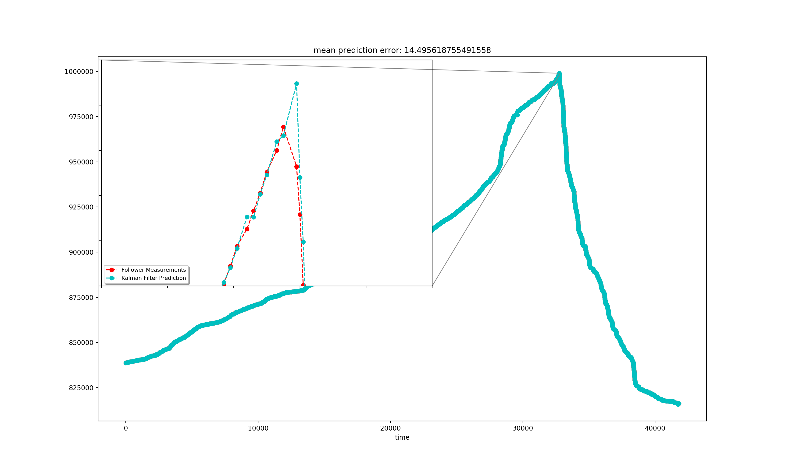
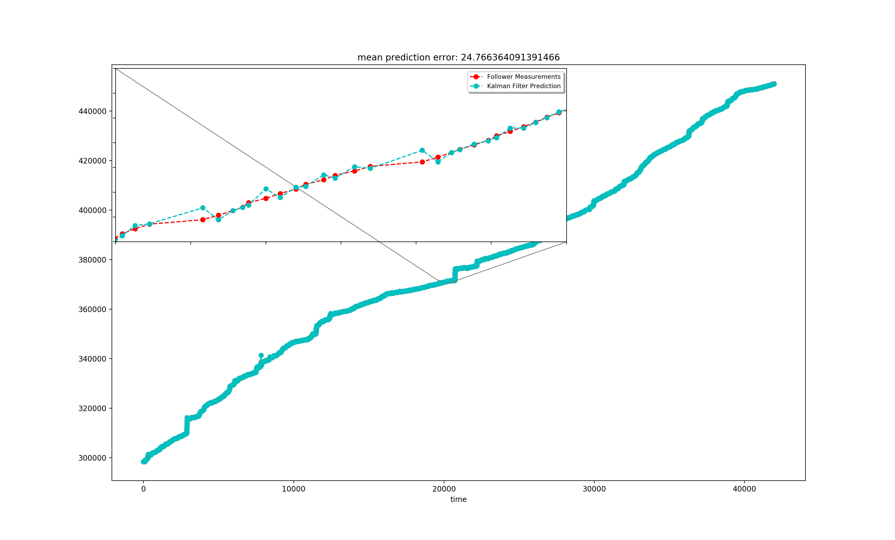

# Fans_Kalman
[](https://shields.io/)

## Dependencies

[](https://shields.io/)
[](https://shields.io/)
[](https://shields.io/)
[](https://shields.io/)
[](https://shields.io/)

## Introduction

**A Kalman filter is utilized to predict the fans of any vtuber.** The Kalman impl is inherited and modified from [here](https://github.com/zziz/kalman-filter.git): 

We expect that there is an update of the follower number every 5 minutes. If there isn't, then the Kalman filter will only perform the time-update, while the measurement-update will not be performed.

## Quickstart
Run:

```
python3 fans_kalman.py
```
to see the prediction result.

Run: 

```
python3 grid_search.py
```
to find the two optimized parameters: 
  1. sigma_w: The variance of the process noise
  2. sigma_v: The variance of the measurement noise

Nevertheless, the current performance is ok even if these two parameters are randomly chosen.

## Results

The model is 'trained' on the data from [Kizuna ai](https://vtbs.moe/detail/1473830), and it is tested on the data from [mea](https://vtbs.moe/detail/349991143). Here are the results:

Mean prediction error on the training set (kizuna.csv):

<p>
    
</p>

Mean prediction error on the test set (mea.csv):

<p>
    
</p>

## Usage example

First, create a kalman filter with your favorite parameters. Note that input_data[0] is the initial value of the follower number:
```
kalman_filter = fans_kalman(input_data[0], sigma_w = sigma_w, sigma_v = sigma_v)    
```
Then, every 5 minutes, if the new data is avialable, run:
```
new_prediction = kalman_filter.predict_interface(new_obtained_value)
```
to get the prediction of the next time step (next 5 minutes). Note that new_prediction is a number in this case.

Otherwise, run:
```
new_prediction = kalman_filter.predict_interface(None)
```
The model will not be updated by the measurement, and it will still predict the follower number of the next time step (next 5 minutes).
