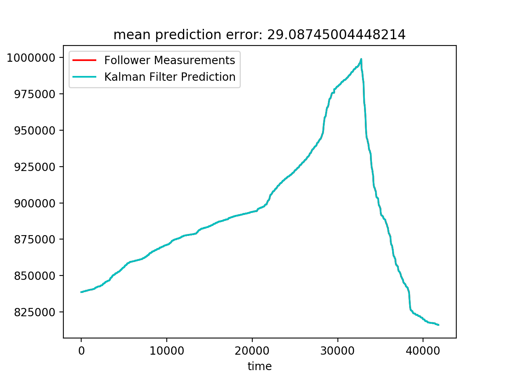
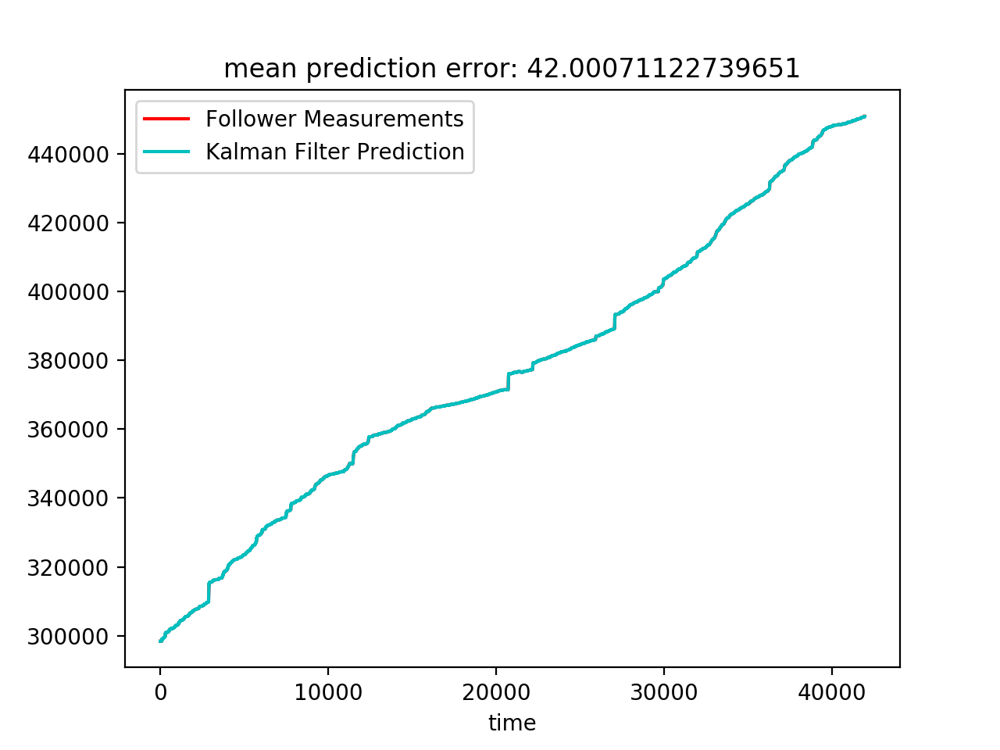

# Fans_Kalman
To predict the fans of any vtuber

The Kalman impl is inherited and modified from [here](https://github.com/zziz/kalman-filter.git): 

We expect that there is an update of the follower number every 5 minutes. If there isn't, the follower number should remain unchanged, and it should be used as an input. 

Run:

```
python3 fans_kalman.py
```
to see the prediction result.

Run: 

```
python3 grid_search.py
```
to find the two optimized parameters: 
  1. sigma_w: The variance of the process noise
  2. sigma_v: The variance of the measurement noise

The grid search has been done, and the optimized parameter has been found. The model is trained on the data from Kizuna ai, 
and it is tested on the data from mea. Here are the results:

Mean prediction error on the training set (kizuna.csv):

<p>
    
</p>

Mean prediction error on the test set (mea.csv):

<p>
    
</p>

For more details, please take a look at my code :D
